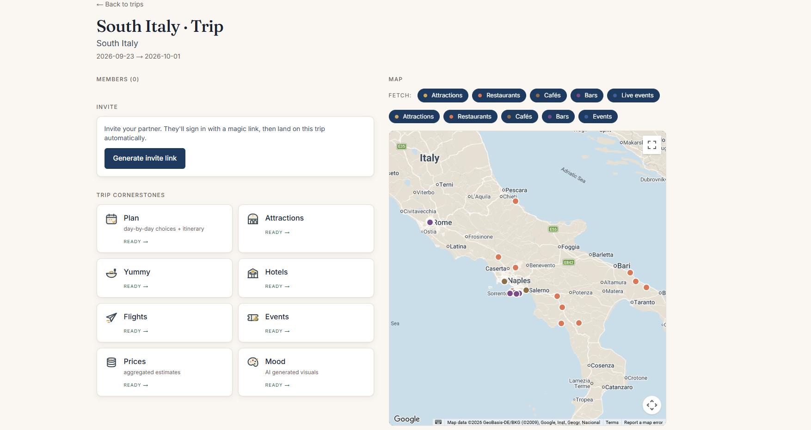
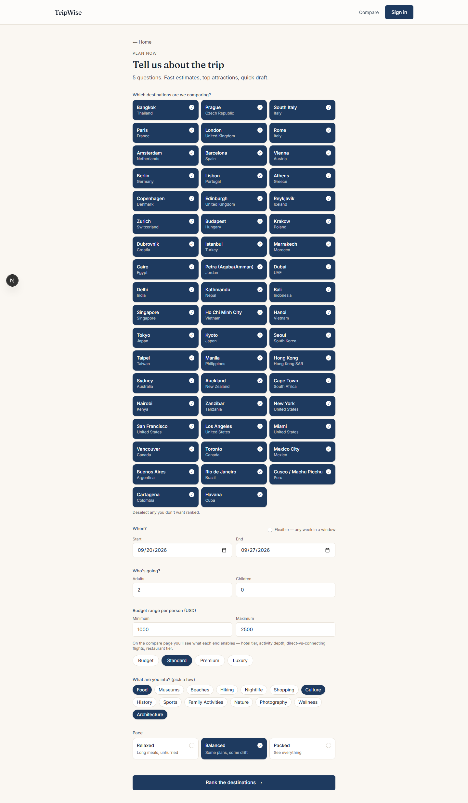
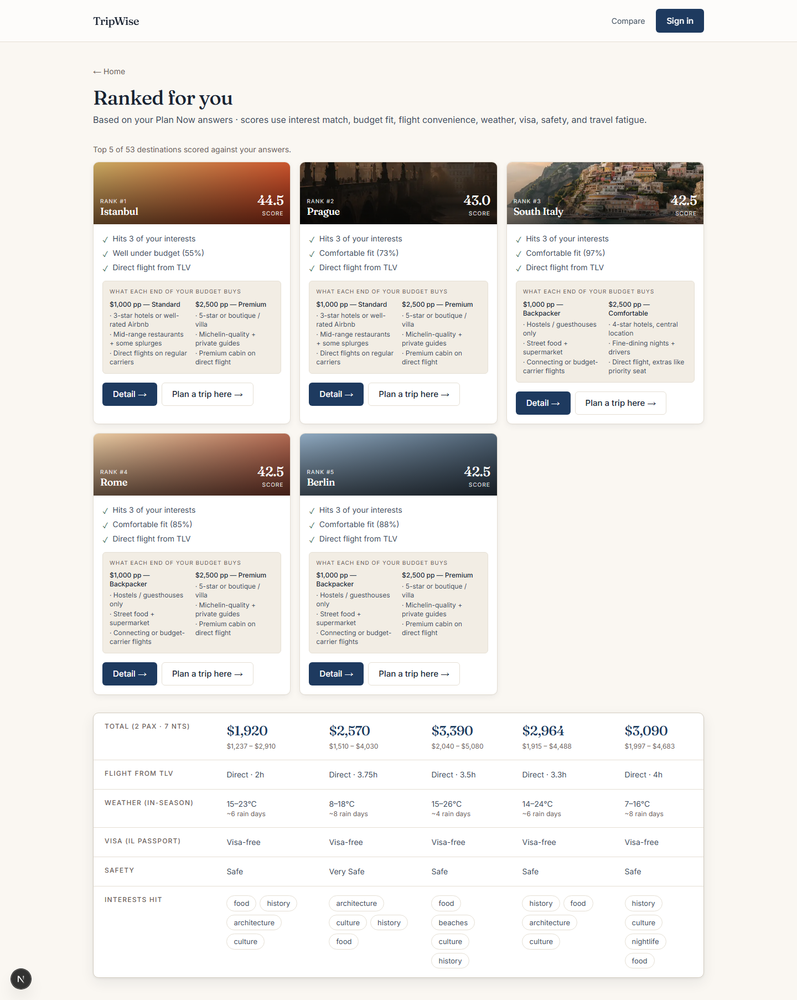
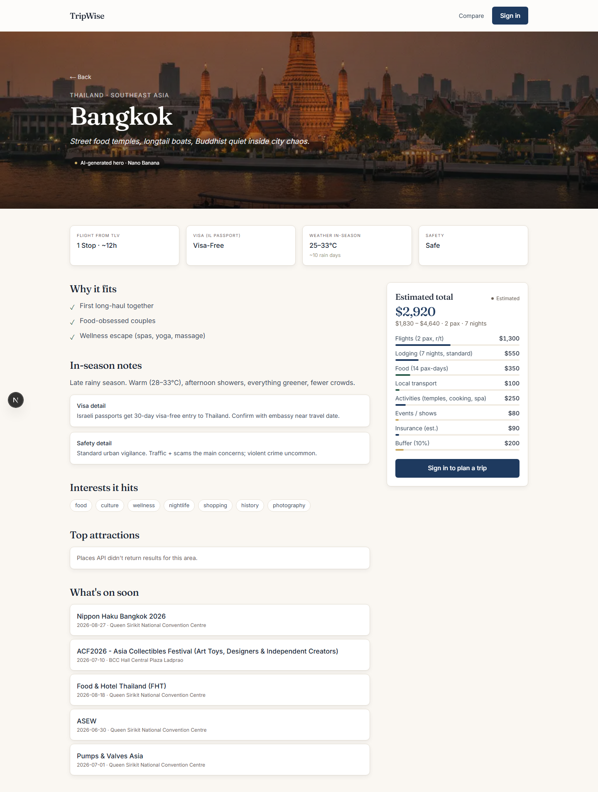

# TripWise

[](https://github.com/AmitAminov/tripwise/actions/workflows/ci.yml)

A trip planner for couples that fixes the worst part of planning together:
one partner's opinion anchoring the other's. TripWise lets both people rate
flights, hotels, and activities **blind**, then reveals both sets of ratings
at once — enforced in the database, not the UI.

Built with Next.js 15 / React 19 / TypeScript on Supabase, plus a small
Python FastAPI microservice for live flight prices.

I built TripWise quickly with an AI-assisted (vibe-coding) workflow to plan an
autumn trip to Italy with my girlfriend — the trip below is that real one.



## The problem

Couples planning a trip juggle dozens of tabs (flights, hotels, weather,
events, visas) and then negotiate — where the first person to say "I love
this one" biases the outcome. Every group-travel tool treats this as a chat
problem. TripWise treats it as a **decision-integrity** problem.

## The decision arena: blind rating + delayed reveal

The core mechanic, enforced at the Postgres layer
([`supabase/migrations/001_init.sql`](supabase/migrations/001_init.sql)):

- Each partner rates the same options independently. A **row-level security
  policy** (`ratings_select_own_or_revealed`) makes partner ratings
  unreadable — not just hidden — until the decision status is `revealed`.
- A **trigger** on the `ratings` table calls `maybe_reveal_decision`, which
  flips a decision from `open` to `revealed` only when every trip member has
  rated every option. No client code can peek early or force a reveal.
- One-click "Save to arena" turns live flight offers, hotels, or attractions
  into rateable options, so the mechanic sits inside a real planning flow
  instead of a toy voting page.

Because the invariant lives in the database, it holds across devices,
browser tabs, and any future client.

## Architecture: provider abstraction with graceful degradation

Every external API sits behind a typed port
([`lib/providers/types.ts`](lib/providers/types.ts)). All calls return a
`ProviderResult<T>` envelope:

```ts
interface ProviderResult<T> {
  data: T | null;
  status: "estimated" | "live_checked" | "cached" | "checking" | "unavailable" | "error";
  source: string;
  checkedAt: string;
  error?: string;
}
```

so every surface renders data provenance ("live price" vs "estimate" vs
"cached") uniformly. Factories in
[`lib/providers/index.ts`](lib/providers/index.ts) pick the implementation
from the environment: with zero API keys the app still runs — flights use a
mock provider, events fall back to a curated seed, hotels to a
deep-link estimator, and keyed surfaces (Places, AI images) degrade to a
friendly "unavailable" state instead of crashing.

Supporting layers:

- **Stale-while-revalidate cache** ([`lib/swr-cache.ts`](lib/swr-cache.ts))
  in front of Places, Routes, hotels, and events — serves stale data while
  revalidating in the background and coalesces concurrent misses.
- **Per-provider timeouts** (Places 3s, Routes 4s, Flights 8s, Events 5s)
  so one slow upstream never stalls a page.
- **Currency normalization** ([`lib/fx.ts`](lib/fx.ts)) with a 24h-cached
  FX feed and hardcoded fallback rates when the feed is unreachable.

## Grounded AI day planning

The AI day-planner ([`lib/ai/gemini.ts`](lib/ai/gemini.ts)) uses Gemini with
**structured output** (`responseSchema`, JSON mime type) and is grounded on
real Google Places results — the model arranges venues that actually exist
rather than inventing them. Items are geocoded on insert, walking-time chips
between consecutive stops come from the Google Routes API (legs computed in
parallel), and the plan exports to Google Calendar.

## Live flight prices

[`python-services/flights`](python-services/flights) is a FastAPI wrapper
around [fast-flights](https://github.com/AWeirdDev/flights) (Google Flights
scraping — real prices without a paid GDS), normalizing prices, durations,
and layovers into the shape the Next.js `FlightProvider` expects.

## Stack

| Layer | Choice |
|---|---|
| Frontend / server | Next.js 15 (App Router), React 19, TypeScript, Tailwind v4 |
| Auth + database | Supabase (magic-link auth, Postgres, RLS, triggers) |
| Runtime / tooling | Bun |
| Flights | Python 3.11+, FastAPI, fast-flights |
| External APIs | Google Places / Routes / Geocoding / Maps JS, Gemini, Open-Meteo, PredictHQ, Ticketmaster (optional), LiteAPI (optional) |
| Testing | Vitest (58 unit tests), Playwright (5 e2e smoke tests) |

## Screenshots

Captured from the running dev server. Surfaces that depend on a missing or
failing provider degrade to curated/mock data by design, so every page below
renders regardless of which API keys are configured.

**Home — planning depths + the destination library**


**Survey — adaptive intake (flexible date windows, budget ranges)**



**Compare — full library ranked against your answers**



**Destination detail — cost breakdown, visa/safety, what's on**



The trip surfaces behind sign-in (live flight prices, the AI day plan with
walking-time chips, and the decision arena's blind-rate/reveal flow) need an
authenticated Supabase session plus seeded trip data, so they aren't in the
automated capture set; the walkthrough in
[STATUS.md](STATUS.md#demo-walkthrough) describes each of them.

## Run it locally

Prerequisites: [Bun](https://bun.sh), a free [Supabase](https://supabase.com)
project, and (optionally, for live flight prices) Python 3.11+.

### 1. Install

```bash
bun install
```

### 2. Set up Supabase

1. Create a project at [supabase.com](https://supabase.com) and wait for
   provisioning.
2. **Run the schema:** SQL Editor → New query → paste the contents of
   [`supabase/migrations/001_init.sql`](supabase/migrations/001_init.sql) →
   Run. Then repeat with
   [`supabase/migrations/002_itinerary.sql`](supabase/migrations/002_itinerary.sql).
   (The dashboard SQL editor is the intended path — no CLI required.)
   This creates the tables, enums, RLS policies, and the reveal trigger.
3. **Auth redirect:** Authentication → URL Configuration → Site URL
   `http://localhost:3000`, and add `http://localhost:3000/auth/callback`
   to Redirect URLs.

### 3. Environment

```bash
cp .env.local.example .env.local
```

Fill in `NEXT_PUBLIC_SUPABASE_URL` and `NEXT_PUBLIC_SUPABASE_ANON_KEY`
(Supabase dashboard → Settings → API). Everything else is optional — the
provider factories fall back to mocks, curated data, or a graceful
"unavailable" state when a key is absent. `.env.local.example` documents
where each key comes from.

### 4. Run

```bash
bun run dev
```

Open http://localhost:3000, sign in with a magic link.

### 5. Optional: live flight prices

```bash
cd python-services/flights
python -m venv .venv
.venv\Scripts\activate          # Windows (macOS/Linux: source .venv/bin/activate)
pip install -r requirements.txt
python -m uvicorn main:app --port 8001 --reload
```

Then set `FAST_FLIGHTS_BASE_URL=http://localhost:8001` in `.env.local`.

## Testing

```bash
bun run test        # 58 Vitest unit tests (scoring, FX, SWR cache, visa, events, queue…)
bun run typecheck   # tsc --noEmit
bunx playwright install chromium   # one-time
bun run test:e2e    # 5 Playwright smoke tests (needs `bun run dev` in another terminal)
```

The unit suite needs no API keys or `.env.local` — mock providers make it
self-contained. CI (GitHub Actions) runs the typecheck and unit suite on
pushes to `main` and on pull requests.

## Known limitations

- **In-memory queue and cache.** The deep-research job queue and the SWR
  cache live in process memory. They work for a single long-lived dev
  server, but won't survive serverless deployment or multiple processes —
  the interfaces are designed to swap in Redis / a durable queue (BullMQ,
  Cloudflare Queues) without touching call sites, but that swap hasn't
  happened.
- **Placeholder scoring inputs.** Parts of the destination-score formula
  run on curated estimates rather than live signals; the visa lookup is a
  curated matrix covering common passport/destination pairs only.
- **Scraper-backed flights.** fast-flights scrapes Google Flights; it's
  great for a demo and fragile as a production dependency.
- **Seeded destinations.** Deep editorial content exists for three
  destinations (Bangkok, Prague, South Italy); other cities work via
  geocoding but with thinner data.
